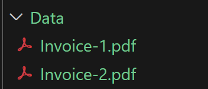

## Project Description: Converting Semi-Structured Data (PDF) into Structured Data (JSON)

## Goal:
The primary objective of this project is to develop a solution that efficiently converts semi-structured data, such as PDF documents, into structured formats like JSON. By automating this process, we aim to simplify and streamline data extraction, making it more dynamic, flexible, and adaptable to varying document formats provided by different vendors.

## Current Approach & Challenges:
Currently, data extraction from semi-structured sources like PDFs or images relies heavily on traditional Machine Learning (ML) and Computer Vision techniques such as Pytesseract. These methods often depend on predefined rules and manual annotations to extract data, making the process rule-based and rigid.

The key challenge arises when dealing with data from multiple vendors, each using different formats for their documents. The existing rule-based system struggles to adapt to these variations. This means that with every new vendor, significant manual effort is required to annotate and adjust the extraction process, making it both time-consuming and error-prone. A more dynamic and adaptable approach is essential to handle this variability.

## Problem Statement:
It's not feasible to predict the exact format or structure of the data that vendors will send. Consequently, we need a more robust solution that can dynamically extract data from these semi-structured sources without manual intervention or rigid rule-based systems. Manually annotating new vendor data each time is inefficient and becomes a bottleneck when using traditional document extraction services.

## Proposed Solution:
We propose leveraging advanced data extraction tools that use intelligent document extraction services, allowing for dynamic data collection from semi-structured sources. This approach will automate the extraction process, ensuring scalability and reducing the need for manual intervention. By converting the semi-structured data into structured formats like JSON, the data becomes easier to work with and can be seamlessly integrated into downstream systems.

## Use Cases:

Invoice Processing via API: Automate the posting of invoices using API calls by converting the PDF invoices into structured JSON data. This will enable businesses to process invoices more quickly and efficiently, regardless of the vendor’s document format.

Invoice Comparison for Similarities: Extract key data from invoices to compare them for potential duplicates, discrepancies, or similarities. This is crucial for detecting fraud, ensuring data accuracy, and optimizing financial operations.

Bank Details Extraction and Verification (FIN): Extract bank details from semi-structured financial documents, such as invoices, and verify the legitimacy of bank accounts before payments are made. This step is vital for mitigating the risk of fraudulent transactions and ensuring that payments are directed to verified, legitimate accounts.

## Traditional ML/Computer Vision - Pytesseract
Data from pdf/image were exteacted using annotations - it was more a rule based.

## Problem
You cannot judge everytime what data Vendor sends / what format you need to extract it from
So, you need a common logic which dynamically collect data from these semi structured Data.
---New vendor - annotate using Document extraction service in BTP
    its a tedious job to do it everytime.

## Use case
1. Post Invoices using API call
2. Compare invoices for similarities.
3. FIN  -- Extract Bank deatils and verity legit bank accounts before making payment.

## How to test?
Use my public link on Streamlit.io to test this.
https://sap-genai-integration-invoice-flexiextract.streamlit.app/

For Data, download or Clone the Data folder under this project. 
and upload it as pdf invoice file.

## Run the backend
uvicorn backend.main:app --reload

## Run Frontend
streamlit run .\frontend\app.py